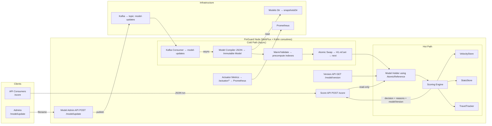

# 🛡️ FinGuard

**FinGuard** is a high-performance, open-source risk scoring API for fintech use cases.  
It evaluates payment transactions in real time (~1M lookups/sec per node) against a hot-swappable, in-memory model.

The goal: demonstrate how to design **fraud/risk engines** that are:
- **Fast**: lock-free reads, compact in-memory structures, bounded latency
- **Safe**: API never accepts PII (emails must be hashed, identifiers opaque)
- **Dynamic**: new models are compiled in the background and swapped atomically
- **Explainable**: every score includes reasons, weights, and model version

---

## ✨ Features

- REST API with **WebFlux + Kotlin coroutines**
- **Immutable model snapshots** stored on disk, compressed in memory
- **Hot-swappable model** via Kafka broadcast
- **Explainable risk scores** with reasons per decision
- **Velocity windows** (5m / 1h / 24h) for user, device, BIN, merchant
- Heuristics:
    - BIN ↔ country mismatches
    - MCC risk categories
    - High-risk/sanctioned countries
    - Disposable email domains
    - Impossible travel (IP country jumps too fast)
    - Split-payments detection
    - Outlier amounts (rolling mean/variance)
- **Configurable weights & thresholds** via JSON snapshot
- **Admin endpoint** with API key authentication to trigger model updates
- **Prometheus metrics** & health endpoints

---

## 🏗️ Architecture




- **Hot path:** only lock-free reads against `AtomicReference<Model>`
- **Cold path:** background compilation + validation + atomic swap
- **Eventing:** Kafka ensures all nodes reload the same model version

---

## API Endpoints
| Method | Path                          | Description                               | Details                                    |
|--------|-------------------------------|-------------------------------------------|--------------------------------------------| 
| GET    | `/api/v1/model`               | Get current model version and update timestamp | [Details](#check-model-version)            |
| POST   | `/api/v1/score`               | Score a transaction against the current model | [Details](#score-transaction)              |
| POST   | `/api/v1/model/admin/update`  | Admin endpoint to update the model (requires API key) | [Details](#admin-endpoint-to-update-model) |
| GET    | `/actuator/health`            | Health check endpoint                      | 
| GET    | `/actuator/metrics`           | Prometheus metrics endpoint                | [Details](#prometheus-metrics)             |
| GET    | `/actuator/info`              | Application info (version, build time)    |
| GET    | `/actuator/prometheus`        | Prometheus metrics endpoint                |

## 🚀 Quick start

### 1. Clone repo

```bash
git clone https://github.com/yourname/finguard.git
cd finguard
```

### 2. Start Kafka (Redpanda)

```bash
docker compose up -d
```

### 3. Run the app

```bash
./gradlew bootRun
```

## Check model version

```bash
curl localhost:8080/api/v1/model
# {"modelVersion":"2025-08-16T18:00:00Z#001","modelUpdatedAt":"2025-08-16T18:00:00Z"}
```

## Score transaction

```bash
curl -X POST localhost:8080/api/v1/score \
  -H 'Content-Type: application/json' \
  -d '{
    "amount":19.99,
    "currency":"GBP",
    "timestamp":"2025-08-16T18:05:00Z",
    "ip":"198.51.100.24",
    "ipCountry":"CZ",
    "deviceId":"dev:xyz",
    "userId":"usr:1",
    "emailHash":"a1b2c3d4...",
    "cardBin":"421234",
    "merchantId":"MRC789",
    "mcc":"7995",
    "merchantCountry":"GB",
    "userCountry":"CZ"
  }'
```
Example response:
```json
{
  "decision": "REVIEW",
  "risk": 67,
  "reasons": [
    {"code":"BIN_COUNTRY_MISMATCH","w":12,"issuer":"GB","userCountry":"CZ"},
    {"code":"MCC_HIGH_RISK","w":15,"mcc":"7995"},
    {"code":"VELOCITY_TXN_PT5M","w":10,"value":7,"threshold":5}
  ],
  "modelVersion": "2025-08-16T18:00:00Z#001",
  "modelUpdatedAt": "2025-08-16T18:00:00Z"
}
```
## Admin endpoint to update model

```bash
curl -X POST localhost:8080/api/v1/model/admin/update \
  -H 'X-API-Key: CHANGEME' \
  -H 'Content-Type: application/json' \
  -d '{"filename":"model-sample.json"}'
```

All running nodes consume the Kafka event and reload the new model asynchronously.

## Model snapshot format

The project comes with a sample model snapshot in `src/main/resources/model-sample.json`:
```json
{
  "version": "2025-08-16T18:00:00Z#001",
  "createdAt": "2025-08-16T18:00:00Z",
  "binTable": [
    { "prefix": "400000", "country": "US" },
    { "prefix": "421234", "country": "GB" }
  ],
  "mccRisk": { "7995": "HIGH", "4829": "HIGH", "5814": "LOW" },
  "countryRisk": { "RU": 20, "GB": 0, "US": 0 },
  "disposableEmailDomains": ["mailinator.com","10minutemail.com"],
  "lists": {
    "allow": { "merchantIds": ["MRC123"] },
    "deny":  { "ips": ["203.0.113.42"], "devices": ["dev:abc"] }
  },
  "weights": {
    "BIN_COUNTRY_MISMATCH": 12,
    "MCC_HIGH_RISK": 15,
    "DISPOSABLE_EMAIL": 10,
    "IP_COUNTRY_MISMATCH": 8,
    "IMPOSSIBLE_TRAVEL": 18,
    "AMOUNT_OUTLIER": 12,
    "SPLIT_PAYMENTS": 10
  },
  "thresholds": { "accept": 20, "review": 50, "decline": 80 },
  "velocity": {
    "windows": ["PT5M","PT1H","P1D"],
    "limits": {
      "txnCount": { "PT5M": 5, "PT1H": 15, "P1D": 30 }
    },
    "caps": { "velocity": 30, "geo": 25, "country": 35 }
  }
}
```

## 🔐 PII policy
- API never accepts raw emails
- Use emailHash (e.g., SHA-256 hex) instead
- Identifiers (userId, deviceId) must be opaque tokens
- Logs never contain sensitive fields

## 📊 Observability

### Prometheus metrics
Prometheus metrics available at:

```bash
curl localhost:8080/actuator/prometheus
```
Includes:
- request latency (p50/p90/p99)
- QPS
- error ratio
- model reload times
- active model version

## 🛠️ Tech stack
- Kotlin 2.1.0, Java 21
- Spring Boot 3.5.4 (WebFlux, coroutines, Actuator, Kafka)
- Redpanda (Kafka-compatible) for local dev
- Jackson for JSON
- Micrometer + Prometheus for metrics

## 📈 Roadmap
- Lucene FST-based BIN compression
- Decline ratio velocity features
- Distinct merchant velocity checks
- Integration tests with Testcontainers
- Community-curated BIN data repo integration

## 🤝 Contributing

Pull requests welcome! Please:
- Keep PII safety in mind
- Provide reproducible benchmarks for performance changes
- Add tests for new scoring heuristics

## 👤 Author

Built by [Tomas Zezula](https://github.com/zezutom) as a showcase of fintech risk engine design:

**High throughput, explainable, PII-safe.**

